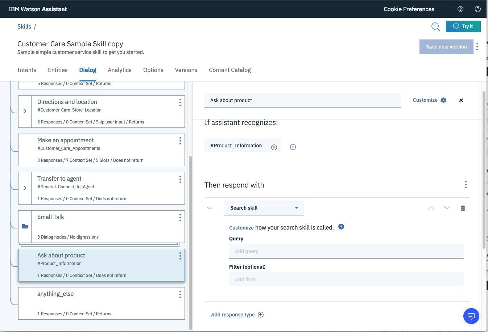
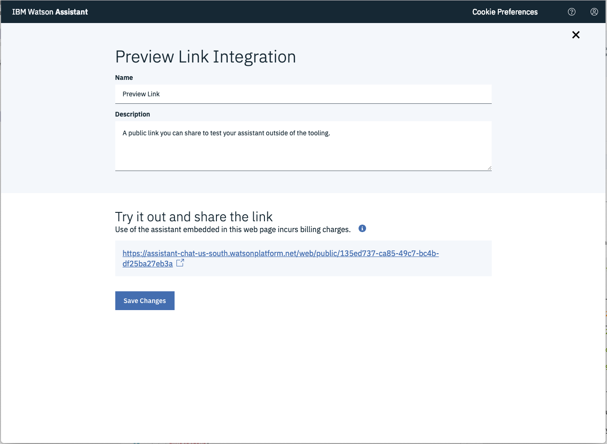
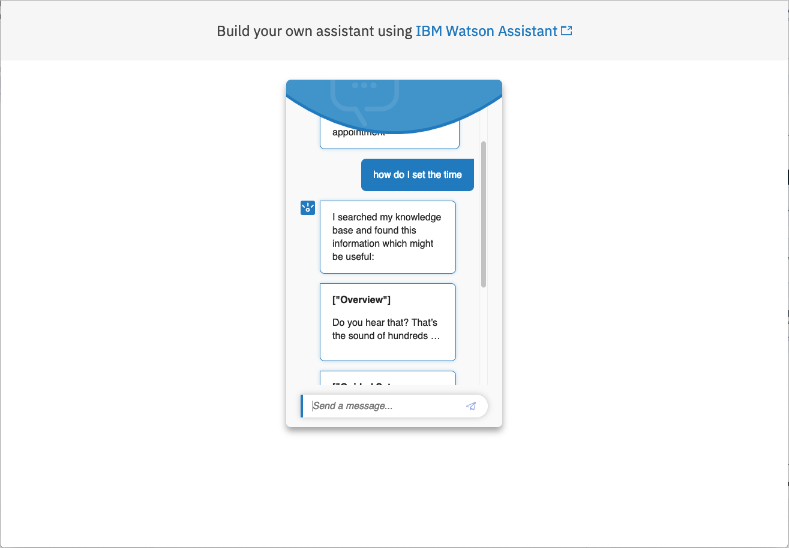
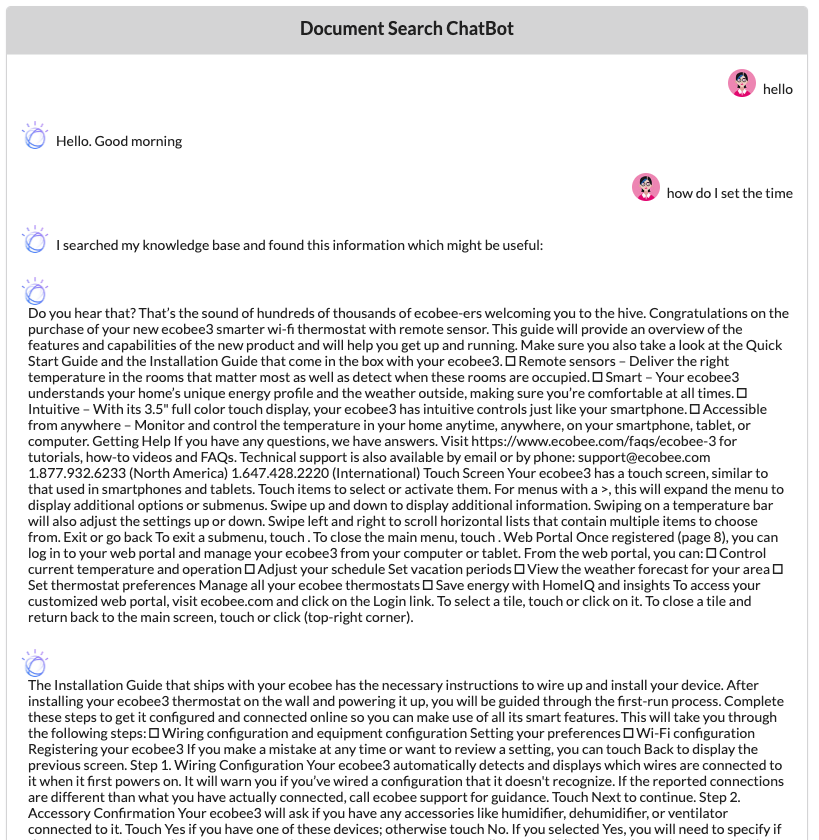

# watson-discovery-sdu-with-assistant-search-skill

* Use Assistant dialog for better chatbot experience
* Use "customer-care" skill provided by Assistant
* Use search skill to search Disco if question is "anything-else" and reply with disco passages

# What is a Search Skill?

PLUS or PREMIUM PLAN REQUIRED (CURRENTLY BETA)

You can have a search skill by itself, where all user input is passed to discovery.

If you have both, only if the dialog skill reaches "anything_else" node will it search skill be triggered.

# Differences between Search Skill and Webhooks

* No code required inside dialog node
* Configuration of combinging dialog skill and search skill is done by creating a "Assistant" instance.
* Use of search skill requires using the V2 version of the Assistant Service API.

# TODO:

* Remove references to calling Disco directly
* Add action creds to .env
* Create better use case for invoking search skill from Assistant dialog node
* Format Disco results better in chatbot
* Modify search type in Discovery to use passages

# Steps:

> Assumes completion of Watson Discovery setup described in https://github.com/rhagarty/watson-discovery-sdu-ui and Watson Assistant setup described in https://github.com/rhagarty/watson-discovery-sdu-with-assistant-cloud-functions.

## Create Search Skill

Start creation process:


Name your skill:


Attach to Discovery instance and collection:


Configure how the search will respond:


## Invoke the Search Skill from dialog node

Modify the "Ask about product" dialog node to call out to the search skill:



## Create Assistant instance to combine dialog and search skills:

In order to use both skills, you need to create an `Assistant` object that integrates them.


## Test in Assistant Tooling

From the `Assistant` panel, press the `Preview Link` button:


Then press the `Preview` URL:



Then use the chatbot to test accessing the search skill:



## Access to results in application

Results will be returned in Assistant response object.

* If the result is from the normal dialog conversation:

```json
{ output:
   { generic:
      [ { response_type: 'text',
          text: 'Would you like me to transfer you to a representative?' } ],
     intents:
      [ { intent: 'General_Connect_to_Agent',
          confidence: 0.9979484558105469 } ],
     entities: []
    }
}
```

If the result is from the search skill:

```json
{ output:
   { generic:
      [ { response_type: 'search',
          header: 'I searched my knowledge base and found this information which might be useful:',
          results:
           [ { body: 'Do you hear that? That’s the sound of hundreds of thousands of ecobee-ers welcoming you to the hive. Congratulations on the purchase of your customized web portal, visit ecobee.com and click on the Login link. To select a tile, touch or click on it. To close a tile and return back to the main screen, touch or click (top-right corner).',
               title: '["Overview"]',
               url: null },

```

# Sample Output


